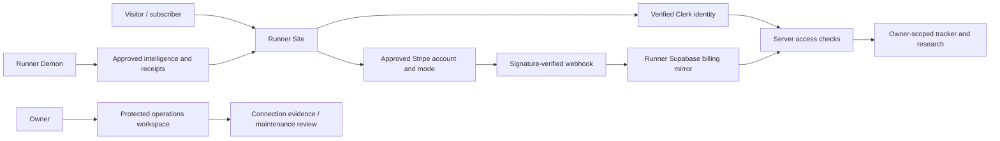

# Runner connected launch - September 26, 2026

## Route to release

Keep `runner_sports-site` as the product and authenticated owner workspace, `runner_sports_demon` as the intelligence/runtime engine, and their existing repositories as implementation truth. The refreshed public Site leads with the Runner Demon car and game-day culture. The owner works from `/admin/operations` after verified deployment and sign-in.

Clerk owns identity; Stripe owns subscription/payment truth; the Supabase mirror provides validated server entitlements and an event journal. Use the existing server-side integration. Adding Clerk as a direct Supabase JWT provider is a separate access design, unnecessary for the present owner-filtered server API; do not enable extra client database privileges as a setup shortcut. Current provider guidance: [Clerk/Supabase integration](https://clerk.com/docs/guides/development/integrations/databases/supabase), [Stripe webhook signature and delivery handling](https://docs.stripe.com/webhooks).

## Verified browser connections

These are dated inspection receipts, not continuous monitoring or proof that the application is wired.

| Provider | Observed target | Required resolution |
| --- | --- | --- |
| Clerk | Fee The Developer / Runner Sports & Analytics; app `app_3JtKtQSrFSvhpXyRg2jwqOuENAC`; development instance `ins_3JtKtPz2hMmWOTqiaQXG61hkdq7`; frontend `fast-doe-1733.clerk.accounts.dev` | Environment switcher offered development and Create production instance. Local keys instead indicate live frontend `clerk.werunsportsandanalytics.com`. Verify the intended application before replacing keys or creating production. |
| Supabase | Fee The Developer LLC / Runner Sports; `vrhvvywncclonfwplsjl`; main Production; Healthy | Local Site URL points to a different project not present in the accessible organization list. Reconcile keys/URL to the approved target; apply reviewed migrations only with exact authorization. |
| Stripe | Initial page: Fee The Developer LLC (Found App), `acct_1TCTjGHWhC70mvOk`; latest page: Fee The Developer LLC sandbox, `acct_1U9IwLLGpqvyN2sE` | Confirm the merchant of record. No local Stripe key, signing secret or paid price IDs were configured at inspection. Test and live bindings must remain distinct. |
| Vercel | Fee The Developer team; project search found `runner-dashboard-site`, linked to `FeeTheDeveloper/runner_dashboard-site`. Import search separately confirmed `FeeTheDeveloper/runner_sports-site` is available. | Create the exact Site project from the reviewed release revision; do not repoint the other Runner repository. No import or deployment was submitted. |

No provider configuration, production migration, DNS change, purchase, deployment or live subscription was made by this pass. The prior live-domain check returned 404 and remains a release blocker until deployment acceptance supersedes it.

## Local implementation

- Premium public homepage uses the existing Runner-branded Demon concept artwork and honest market unavailable states.
- Shared persisted skins: Runner original, Eagles Kelly Green and Midnight Green, Phillies, 76ers, Flyers and Union. First visit defaults to Kelly Green; explicit saved preference takes precedence. Color choice is not a schedule or uniform claim; semantic error/success colors remain stable.
- Explicit Clerk instance pin and matching test/live key modes prevent an unverified identity connection. Missing bindings leave sign-in unavailable and protected routes closed.
- Supabase server client requires an exact approved project binding; a mismatched URL cannot receive privileged requests.
- Billing customer ownership, merchant/mode binding, checkout reuse and verified subscription synchronization are implemented with a transactional database event journal. See the billing handoff for exact migrations and acceptance.
- `/admin/operations` separates server configuration, dated inspection evidence, saved receipt age and maintenance gates. It does not grant remote command authority or assert a persistent Runner Sports Plug process.

## Plans and usage

Keep the existing Scout, Pro and Command identifiers. The owner requested competitor-aligned pricing and switching offers. Official pages checked September 26, 2026 list [Outlier](https://www.outlier.bet/) at $19.99 / $29.99 / $79.99 monthly and [BettingPros](https://support.bettingpros.com/hc/en-us/articles/26544095753371-How-much-does-your-premium-subscription-cost-What-plans-do-you-offer-How-to-Upgrade) at $29.99 monthly; BettingPros advertises an annual equivalent of $9.99/month. These are benchmarks, not Runner features or approved Stripe prices.

**Proposal awaiting owner response:** Scout free, Pro $19.99/month, Command $29.99/month; switching offer 20% off the first three monthly invoices, then normal price, one redemption per verified customer and no discount stacking. Annual terms remain unset. No coupon or product was created. Final checkout must show the actual recurring amount, discount duration and renewal terms.

Model access should cover two separately metered capabilities: sports prediction engines and conversational assistants. A subscription never overrides a model's validation status. Measure cost and latency in internal testing before setting included usage; enforce an atomic reservation, settlement and refund ledger with per-customer/month limits and idempotent request IDs. Show remaining allowance and reset date before a request. Do not sell unlimited unmeasured inference. Prediction execution remains unavailable until an approved model and quota policy are implemented and accepted. Command needs a tested additional benefit before being sold above Pro.

## Agent dialogue and autonomous operations

These are rollout requirements, not a claim that a chat service, monitoring worker or outbound sales dispatcher is installed.

- Every representative appears with a persistent **Runner AI representative** label and clear role. Agent accounts are excluded from human member, active-user and testimonial counts. Agents may welcome, explain research and moderate within assigned capabilities; they must not pose as independent customers or invent wins, activity or endorsements.
- Bind the representative ID to a verified account and tenant separately from its display portrait/outfit. No inherited email permissions, shared user credentials or ambient owner authority. Existing Deezy/Kendra portrait and account mappings still require confirmation.
- Internal model tests use a separate cohort and recorded model/data versions. New members see a clearly labeled beta only after an accepted internal evaluation; do not silently treat all members as experiments. Behavioral telemetry records bounded operational events, not raw private chat or credentials, with documented retention and access.
- Stage rollout: internal shadow evaluation, invited opt-in beta, limited release, then wider release. Compare freshness, invalid outputs, latency, errors, inference cost and outcome calibration; define numerical thresholds from the evaluation before widening traffic. Pause on failed identity checks, budget exhaustion, stale data or invalid model status.
- Routine monitoring, research refresh, draft preparation and local maintenance can run within explicit capability and spend limits. External pitches may be drafted automatically; sending requires the approved recipient/campaign scope. Financial commitments, permission grants, production mutations and publication retain the exact-action authority required by the repository contract. Owner filings and owner decisions remain human responsibilities.
- Deploy the worker with durable job IDs, tenant-scoped credentials, atomic claim leases, retries/backoff, duplicate suppression, per-action audit receipts, a kill switch and a tested recovery procedure. The dashboard should display last successful run, next run, current failure, budget and actor; a static healthy badge is insufficient. A percentage autonomy claim is not an acceptance test.

## Wardrobe references

Nine original Fanatics images were downloaded: three views each of the Kelly Green Barkley jersey (201425247), Helmet Retro hoodie (202406553), and New Era Core Team trucker hat (203845192). The user's `Clothing Assets/Fanatics Runner References 2026-09-26` folder contains original AVIF files, source URLs and SHA-256 provenance in `manifest.json`. Supplied screenshots are preserved. Demon `.runner/agents/wardrobe.json` indexes the collection. No purchase, portrait identity assignment, account avatar update or public asset upload occurred.

## Release sequence and handoff

1. Confirm the intended Clerk application, Supabase target, Stripe merchant and Site deployment project. Retain existing environment values securely until the replacement target is verified.
2. Complete local review/test/build evidence. Review tracker ownership and billing SQL migrations together. Use an isolated staging database for provider-role and two-account acceptance.
3. Obtain exact external-action authorization. Quiesce old tracker traffic, back up the approved database, apply reviewed schema, and deploy the owner-scoped build as one maintenance operation. Never restore the old unscoped tracker reader.
4. Exercise sign-up/sign-in, checkout in the approved sandbox, webhook replay/out-of-order delivery, cancellation, expired access, portal ownership, and accounts A/B isolation. Do not convert a sandbox receipt into a live payment claim.
5. Set the approved live credentials and prices only after merchant/terms acceptance; validate production webhook delivery and domain health. Identify the persistent Demon host and its monitoring/backup owner.
6. Use the operations workspace for scheduled human/agent reviews, recording requester, authenticated actor, action, target, result and timestamp. Continuous monitoring needs an explicitly deployed worker/scheduler, scoped capabilities, alert destination and failure/recovery policy; a plugin mention alone does not install this runtime.

Full-platform calibration, Systems Engine and all previously documented research parity gaps remain separate unfinished work. This document is a concrete release handoff, not a production-ready certification.

## Local verification receipt

- Production build passed after final source changes (Next.js 15.5.25, 33 generated pages).
- Full suite: 43 tests passed. After the anonymous billing-status cache-header repair, all nine billing tests passed again; the production build was repeated successfully.
- Lint passed; production dependency audit reported zero known vulnerabilities. Environment-name reconciliation found no undocumented source references. Changed-text credential-pattern scan returned no matches; this is a bounded scan, not a secrets/security certification.
- Browser: desktop/mobile homepage, loaded car artwork, no mobile horizontal overflow, synchronized selectors and reload persistence checked. The compiled homepage returned HTTP 200. Anonymous tracker and billing-status access returned 401/no-store; disabled checkout returned 503/no-store. The final compiled preview is available on loopback port 3002 while its local process remains running.
- Protected operations redirected to sign-in. Authenticated operations and paid lifecycle remain unverified because production bindings are unresolved.
- Strict premium UI audit: zero findings; DESIGN lint: zero errors and four informational token-mapping warnings. Full cross-browser and zoom coverage remains open.
- Site branch `release/runner-production`, baseline `eeee1e3`; Demon branch `fix/production-readiness`, baseline `d27471c`. Changes are uncommitted. No push, migration, provider mutation or cloud deployment.

## Material audit findings

### CRITICAL

No additional critical defect was established by this bounded local review. This does not certify the deployed environment, which has not passed acceptance.

### HIGH

- Identity/data targets differ between local configuration and inspected provider accounts. Fail-closed guards are implemented; production reconciliation remains mandatory.
- Tracker isolation and billing ownership depend on unapplied schema plus the coordinated application release. Do not expose an old unscoped build against the new release.
- No approved prediction model or enforced inference quota exists. Paid checkout stays disabled by default, and subscription status cannot enable model execution.

### MEDIUM

- Real Clerk sessions, two-account hosted RLS, Stripe lifecycle/reconciliation and deployed receipts remain unverified.
- Persistent monitoring, chat representatives and external work dispatch are not running. The worker/capability/recovery requirements above are the next implementation scope.

### LOW

- Repository build tracing is explicitly scoped to this Site, avoiding accidental selection of a sibling workspace lockfile. Local browser evidence is ignored by Git.

### TESTS REQUIRED

Hosted two-account access isolation, approved sandbox checkout/renewal/cancellation/refund policy, duplicate and reordered webhook delivery, expired checkout recovery, domain routing, deployed freshness and kill-switch/recovery acceptance remain release gates. Local tests are not substitutes for these provider checks.

### RECOMMENDED CHANGES

Reconcile the existing provider identities first; apply reviewed migrations with traffic quiesced and a verified backup; deploy the reviewed Site revision to the exact repository project; complete sandbox acceptance before enabling live checkout. Preserve Demon/Site ownership and existing architecture throughout.
